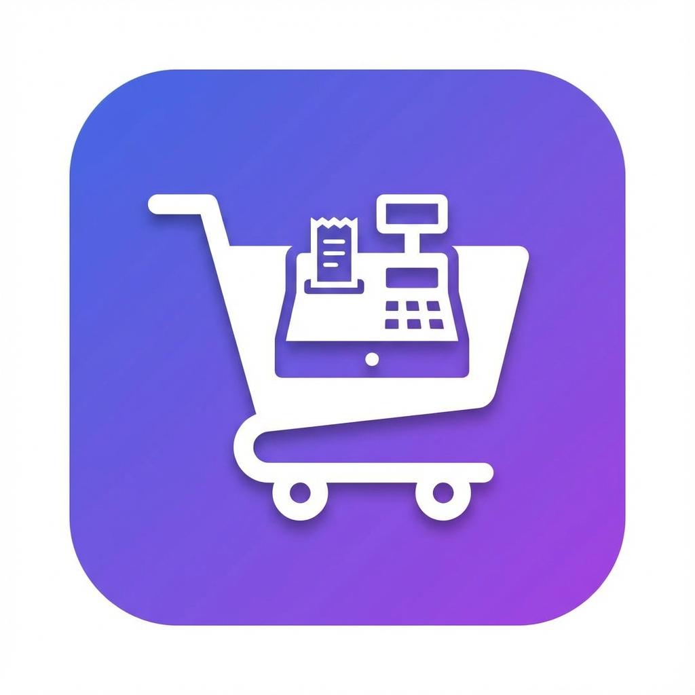

# Universal POS - Point of Sale System



A complete, offline-first Point of Sale (POS) software that works on mobile devices and can be deployed for free on GitHub Pages. Perfect for hardware stores, bookshops, pharmacies, and all types of retail businesses.

## ✨ Features

### 🛒 **Point of Sale**
- Fast and intuitive billing interface
- Product search by name, SKU, or barcode
- Real-time cart management
- Multiple payment methods (Cash, Card, UPI, etc.)
- Tax calculation (GST, VAT, custom rates)
- Customer selection for sales tracking

### 📦 **Product & Inventory Management**
- Complete product CRUD operations
- Multiple units of measurement (kg, pieces, liters, boxes, etc.)
- SKU and barcode support
- Category management
- Stock tracking with low stock alerts
- Bulk import/export (JSON format)

### 👥 **Customer Management**
- Customer database with contact information
- Purchase history tracking
- Total purchases calculation
- Search and filter customers
- Export customer data

### 🧾 **Receipt System**
- **7+ Professional Receipt Templates**:
  - Thermal 58mm (Minimal, Classic)
  - Thermal 80mm (Standard, Detailed, Premium)
  - A4 (Invoice, Formal)
- Customizable receipt header and footer
- Print support for thermal printers
- Download receipts as HTML
- Template selection per store

### 📊 **Reports & Analytics**
- Sales reports (Today, Week, Month, Year)
- Inventory reports with stock valuation
- Customer analytics
- Tax reports
- Export reports to CSV
- Visual statistics dashboard

### ⚙️ **Settings & Configuration**
- Store information setup
- Tax configuration (GST, VAT, etc.)
- Currency settings
- Receipt customization
- Backup and restore data
- Dark/Light theme

### 💾 **Offline First**
- Works completely offline
- No internet required
- Data stored locally in browser (IndexedDB)
- Progressive Web App (PWA)
- Install on mobile devices like a native app

## 🚀 Getting Started

### Option 1: Run Locally

1. **Clone or download this repository**

2. **Serve the files using a local server**:
   ```bash
   # Using Python
   python -m http.server 8080
   
   # Using Node.js
   npx -y http-server ./ -p 8080
   ```

3. **Open in browser**:
   ```
   http://localhost:8080
   ```

### Option 2: Deploy to GitHub Pages (FREE)

1. **Create a GitHub repository**

2. **Upload all files to the repository**

3. **Enable GitHub Pages**:
   - Go to repository Settings
   - Navigate to Pages section
   - Select "main" branch as source
   - Click Save

4. **Access your POS**:
   ```
   https://your-username.github.io/repository-name/
   ```

### Option 3: Install as Mobile App

1. Open the POS in your mobile browser (Chrome/Safari)
2. Look for the "Install" prompt or use "Add to Home Screen"
3. The app will work offline like a native app!

## 📱 Mobile Installation

### Android (Chrome)
1. Open the POS website in Chrome
2. Tap the menu (⋮) and select "Install app" or "Add to Home screen"
3. The app icon will appear on your home screen

### iOS (Safari)
1. Open the POS website in Safari
2. Tap the Share button
3. Select "Add to Home Screen"
4. Tap "Add"

## 🎯 Usage Guide

### First Time Setup

1. **Configure Store Settings**:
   - Go to Settings → Store Info
   - Enter your store name, address, and contact details
   - Set up tax rates and currency

2. **Add Products**:
   - Navigate to Products
   - Click "Add Product"
   - Fill in product details (name, price, stock, etc.)
   - Save

3. **Add Customers** (Optional):
   - Go to Customers
   - Click "Add Customer"
   - Enter customer information

### Making a Sale

1. Go to the POS tab
2. Search and select products
3. Adjust quantities if needed
4. Select customer (optional)
5. Click "Checkout"
6. Choose payment method
7. Complete sale
8. Print or download receipt

### Managing Inventory

- **Add Stock**: Edit product → Adjust stock quantity
- **Low Stock Alerts**: Dashboard shows products below threshold
- **Stock Reports**: View inventory value and status in Reports

### Viewing Reports

1. Go to Reports tab
2. Select date range (Today, Week, Month, Year)
3. View different report types:
   - Sales Report
   - Inventory Report
   - Customer Report
   - Tax Report
4. Export reports as CSV

### Backup & Restore

**Export Data**:
- Settings → Backup & Data → Export All Data
- Saves all products, customers, and sales to JSON file

**Import Data**:
- Settings → Backup & Data → Import Data
- Select previously exported JSON file
- Confirms before replacing existing data

## 🔧 Technical Details

### Technology Stack
- **Frontend**: HTML5, CSS3, Vanilla JavaScript
- **Storage**: IndexedDB (offline database)
- **PWA**: Service Workers for offline functionality
- **Styling**: Custom CSS with mobile-first design
- **Icons**: Unicode emojis (no external dependencies)

### Browser Support
- Chrome/Edge (recommended)
- Firefox
- Safari
- Any modern browser with IndexedDB support

### Data Storage
- All data stored locally in browser's IndexedDB
- No backend server required
- No data sent to external servers
- Regular backups recommended

### Limitations
- Data is device-specific (each device has its own data)
- Clearing browser data will delete all information
- No automatic sync between devices
- Manual backup/restore required for data transfer

## 📋 Receipt Templates

The system includes 7+ professional receipt templates:

1. **Thermal 58mm - Minimal**: Compact design for small thermal printers
2. **Thermal 58mm - Classic**: Traditional receipt with all details
3. **Thermal 80mm - Standard**: Most common thermal printer format
4. **Thermal 80mm - Detailed**: Comprehensive invoice-style receipt
5. **Thermal 80mm - Premium**: Modern design with gradients
6. **A4 - Invoice**: Professional invoice for A4 paper
7. **A4 - Formal**: Formal tax invoice with signatures

All templates are:
- Fully customizable
- Print-ready
- Downloadable as HTML
- Optimized for their respective formats

## 🎨 Customization

### Changing Theme
- Settings → General → Theme → Select Light/Dark

### Customizing Receipts
- Settings → Receipt Settings
- Edit header and footer text
- Select default template
- Configure store information

### Adding Custom Units
Edit `js/products.js` and add to the units array in the product form.

## 🔒 Data Privacy

- **100% Offline**: No data sent to any server
- **Local Storage**: All data stays on your device
- **No Tracking**: No analytics or tracking scripts
- **No Login Required**: No user accounts or authentication

## 🆘 Troubleshooting

### App not working offline
- Ensure service worker is registered (check browser console)
- Try refreshing the page
- Clear cache and reload

### Data disappeared
- Check if browser data was cleared
- Restore from backup if available
- Data is device-specific, check correct device

### Receipt not printing
- Ensure printer is connected
- Check browser print settings
- Try downloading receipt as HTML first

### Low storage warning
- Export and backup data
- Clear old sales records
- Use browser's storage management

## 📄 License

This project is open source and available for personal and commercial use.

## 🤝 Support

For issues or questions:
- Check the troubleshooting section
- Review the usage guide
- Export your data regularly as backup

## 🌟 Features Coming Soon

- Barcode scanner integration
- Multiple user accounts
- Advanced reporting with charts
- More receipt templates
- Discount and promotion management
- Expiry date tracking for pharmacy

## 💡 Tips

1. **Regular Backups**: Export data weekly to prevent loss
2. **Low Stock Alerts**: Set appropriate thresholds for your business
3. **Customer Tracking**: Add customers to track purchase history
4. **Receipt Templates**: Choose template based on your printer type
5. **Mobile Use**: Install as app for better mobile experience

---

**Built with ❤️ for small businesses**

Version 1.0.0
